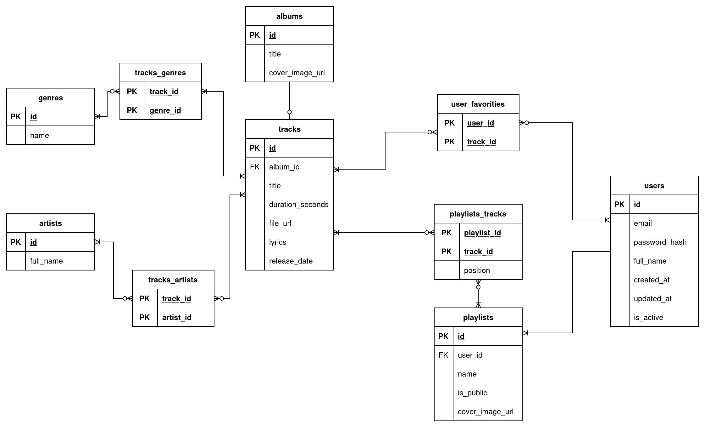

# Веб-приложение для прослушивания музыки

## Ссылки
- [SonarCloud](https://sonarcloud.io/project/configuration?id=gimpelgit_music)
- [Git](https://github.com/gimpelgit/music)

## Задание 1

БД – придумать схему согласно теме проекта, минимум 7 таблиц, обязательное наличие связи многие ко многим. Использовать PostgreSQL. Схему и скрипт добавить в гит.

### ER-диаграмма

### План-факт

| Задание              | План (часы) | Факт (часы) |
| -------------------- | ----------- | ----------- |
| Сделать ER-диаграмму | 1           | 2           |
| Написать схему БД    | 2           | 2.33        |
| Итого                | 3           | 4.33        |

# Задание 2

Смотрите в ветке `console`.

## Задание 3

Backend на SpringBoot + Hibernate

### План факт

| Задание                                                                  | План (часы) | Факт (часы) |
| ------------------------------------------------------------------------ | ----------- | ----------- |
| Написать первое приложение на Spring Boot. Реализовать API (GET-запросы) | 5           | 8           |
| Реализовать API (POST/PUT/DELETE-запросы)                                | 6           | 7.5         |
| Добавить авторизацию и разграничение прав доступа к эндпоинтам           | 7           | 9           |
| Итого                                                                    | 18          | 24.5        |